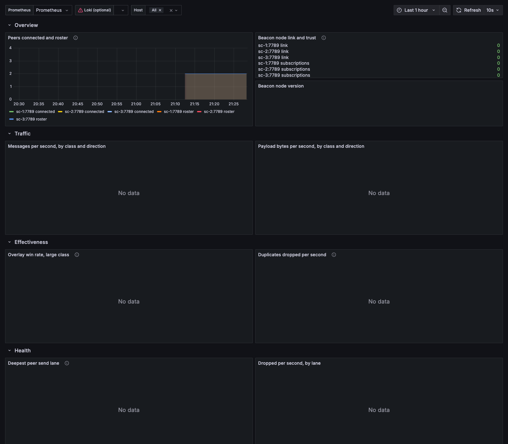

# Rolling the overlay out

The overlay is an accelerator, so the way to deploy it is to prove it accelerates something before
it is everywhere. That means a canary, a control group that is identical except for one flag, and
three numbers agreed on before you start.

Architecture.md's own plan is ten to twenty nodes against a matched control. The sizes are yours;
the method below is the same at any size, and works for a fleet of five as well as for one of two
hundred.

## Before you start

Install the alert rules and the dashboard. They are in the repository next to the deployment
examples:

| File | Where it goes |
|---|---|
| [`deploy/prometheus/alerts.yml`](../deploy/prometheus/alerts.yml) | your Prometheus, through `rule_files:` |
| [`deploy/grafana/fleet-overlay.json`](../deploy/grafana/fleet-overlay.json) | your Grafana, imported or provisioned |

Two things about the rules. `OverlayMemoryHigh` and `OverlaySidecarRestarting` read `process_*`
series, which every target with a process collector exports, so they select on
`job="eth-gossip-overlay"`; if your scrape job has another name, change theirs. And `OverlayMemoryHigh`
carries `512M` as a literal, because Prometheus cannot see the unit's `MemoryMax`. If you change
`MemoryMax` in `deploy/systemd/fleet-overlay.service`, change the rule and the dashboard's
threshold lines to match, or the alert goes off at the wrong number in whichever direction you
moved.

The dashboard's last row queries Loki and the rest does not, so it is useful with a Prometheus
alone. To fill in that row, point a Loki datasource at wherever you ship the sidecar's journal.
[events.md](events.md) is the schema.



That is `examples/compose` running its three sidecars on their own, which is what the demo starts
on a machine with no room for a testnet. The overview row is live; everything fed by beacon node
traffic says "No data" because there is none. The red mark on the Loki variable is the same story:
the demo provisions no Loki datasource, and the rest of the dashboard does not care.

## The four phases

### 1. Observe on every candidate

Install the sidecar on the canary hosts **and** on the control hosts, all of them with
`inject: false`. In that state the sidecar builds the overlay, mirrors the beacon node's
subscriptions, receives everything its siblings send and publishes nothing into its own beacon
node. Both groups then report the same telemetry from the same code on the same hardware, which is
what makes the comparison later worth anything: "would have won" is measured before anything is
injected.

Leave it here for a day. The whole point of the phase is that a mistake in it costs nothing.

**Day one, in this order.** Both of these are drop-in or seed problems rather than network ones,
and both are worth fixing before any number below is believed.

Every host's beacon node lists its sidecar as trusted:

```promql
count(overlay_bn_trusted == 0)
```

Zero, or the alert `OverlayNotTrustedByBn` will tell you the same thing in two minutes. A host at 0
has a beacon node that never got `$FLEET_OVERLAY_TRUSTED_PEER_ARGS` onto its `ExecStart=`, or was
not restarted after it did. A host with no series at all has a beacon node whose HTTP API did not
answer the probe.

Nobody is failing handshakes:

```promql
sum by (role, reason) (rate(overlay_handshake_failures_total[10m]))
```

Empty. Anything under `unknown_key` or `key_mismatch` is a fleet seed that is not identical
everywhere, which is the single most common first-install fault; `hostname` is a roster whose
`hostname` does not match what the host calls itself.

Then the mesh, which should be the whole roster on every host:

```promql
sum by (instance) (overlay_peers_roster) - sum by (instance) (overlay_peers_connected)
```

### 2. Inject on the canary

Turn injection on for the canary group only:

```sh
ansible canary -b -a 'fleet-overlayctl inject on'
```

Set `inject: true` in the canary's `config.yaml` and reload, so a restart does not quietly take
the canary back out. The control group keeps `inject: false` and stays installed and running.

From here the two groups differ in exactly one thing: whether what the overlay delivered is
handed to the beacon node. Everything else, the connections, the metrics and the event log, is
identical.

Watch for an hour before walking away. `overlay_publish_errors_total{reason="no_subscribers"}`
climbing briefly is the subscription race and settles; anything else on the health row that starts
moving when injection is turned on is worth reading before it runs overnight.

### 3. Compare

Give it long enough that the answer is not noise. Fleet spread and win rate are readable within a
day. The proposal side needs weeks, because it is counted in blocks your own validators propose.

The three criteria are below, with the queries.

### 4. Widen

If the criteria hold, move hosts from control into the canary in batches and keep watching the
same three numbers. There is no ordering constraint and no coordination: a host that gets
`inject on` starts contributing immediately, and the rest of the fleet does not have to be told.

Keep a control group until you stop needing to answer "compared with what". A handful of hosts
left on `inject: false` costs nothing and is the only way to measure the next change too.

## The three criteria

### Fleet spread drops

How long a block takes to go from the first host in the fleet that sees it to the last. This is
the number the overlay exists to collapse, and it is a query over the event log rather than a
metric, because it needs one line per message per host joined by message id. [events.md](events.md)
has the schema and the field meanings.

```logql
(
  max by (msg_id) (
    max_over_time({unit="eth-gossip-overlay.service"} | json | event="first_arrival" | topic=~".*beacon_block.*" | unwrap first_arrival_ns [5m])
  )
  -
  min by (msg_id) (
    min_over_time({unit="eth-gossip-overlay.service"} | json | event="first_arrival" | topic=~".*beacon_block.*" | unwrap first_arrival_ns [5m])
  )
) / 1e6
```

That is one value per block, in milliseconds. The criterion is written in p50 and p99 of it, and
LogQL has no quantile across series: `avg`, `max` and `topk` are what it can aggregate with, which
is what the dashboard's panel shows. For the quantiles themselves, run the query over the canary
window and take them off the values, either from Explore's CSV download or from `logcli`:

```sh
logcli query --output=jsonl --since=24h '<the query above>' \
  | jq -r '.line' | sort -n | awk '{v[NR]=$1} END {print "p50", v[int(NR*0.5)]; print "p99", v[int(NR*0.99)]}'
```

Run it once against the canary's hosts and once against the control's. Both groups log the same
event whether or not they inject, so the comparison is between two populations of the same fleet
over the same blocks.

Clock quality is the limit here. Comparing arrival times across hosts is only as good as the
agreement between their clocks, so run chrony with hardware timestamping before reading small
differences as real.

### Overlay win rate for blocks is above 50%

The share of large messages a host got from a sibling before its own beacon node had them. This
one is a metric, so it works without Loki:

```promql
sum(rate(overlay_first_seen_total{class="large",source="overlay"}[1h]))
  / sum(rate(overlay_first_seen_total{class="large"}[1h]))
```

The `large` class is blocks, blobs and data columns together. For blocks alone, the same number
from the event log, which is where the topic is:

```logql
sum(count_over_time({unit="eth-gossip-overlay.service"} | json | event="first_arrival" | topic=~".*beacon_block.*" | source="overlay" [5m]))
/
sum(count_over_time({unit="eth-gossip-overlay.service"} | json | event="first_arrival" | topic=~".*beacon_block.*" [5m]))
```

Both are on the dashboard. `OverlayWinRateFalling` alerts on the first one dropping under 0.5 for
half an hour.

### No measurable increase in beacon node CPU

The sidecar is a second process on a host that was sized for one, and it hands the beacon node
messages the beacon node then validates. Neither should be visible in the beacon node's CPU. Label
your canary hosts in your own scrape config and compare the two groups directly:

```promql
avg(rate(process_cpu_seconds_total{job="lighthouse",canary="true"}[1h]))
  - avg(rate(process_cpu_seconds_total{job="lighthouse",canary="false"}[1h]))
```

The sidecar's own cost is on the dashboard's process row and is the smaller half of the question:

```promql
rate(process_cpu_seconds_total{job="eth-gossip-overlay"}[5m])
```

## What this buys you on chain

The four things to measure, and how long each one takes to answer, are in
[faq.md](faq.md#what-does-the-overlay-actually-buy-me).

## Rolling back

Two steps, in this order.

Stop injecting, everywhere:

```sh
ansible beacon_nodes -b -a 'fleet-overlayctl inject off'
```

This takes effect immediately and needs no restart. From that moment nothing the overlay carries
reaches any beacon node, while the sidecars stay up and keep reporting, so you can see what the
fleet does without the overlay before you remove anything. Set `inject: false` in `config.yaml` and
reload to make it survive a restart.

Then stop the unit:

```sh
ansible beacon_nodes -b -a 'systemctl stop fleet-overlay'
```

The beacon nodes keep every public peer throughout and lose only the trusted peer, which is
exactly a fleet without the overlay. Nothing has to be migrated back and no beacon node has to be
restarted. `deploy/README.md` has the full uninstall, including taking
`$FLEET_OVERLAY_TRUSTED_PEER_ARGS` back out of the Lighthouse unit.
